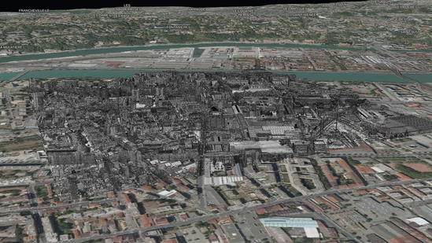

The goal of this tutorial is to give an example on how to use iTowns to visualize some point cloud data.
These data are formated in 3d-tiles, and represent a Lidar acquisition on Lyon city area.
They can be found [here](https://github.com/iTowns/iTowns2-sample-data/tree/master/3DTiles/Point_Cloud_2015). 
They shall be displayed on a `{@link PlanarView}`, as the one created in the [CC46 tutorial]{@tutorial Raster-data-CC46}

## Preparing the field

We are going to use the data displayed in the [CC46 tutorial]{@tutorial Raster-data-CC46}.
We just need to change the initial position of the camera, so that our data appears at the center of the screen when 
loading our webpage.
We are also going to add the labels we displayed in the
[vector data projected on ground tutorial]{@tutorial Vector-data-on-ground} tutorial.

```html
<!DOCTYPE html>
<html>
    <head>
        <meta charset="UTF-8">
        <title>3d-tiles point cloud data</title>
        <style>
            html { height: 100%; }
            body { margin: 0; overflow: hidden; height: 100%; }
            #viewerDiv { margin: auto; height: 100%; width: 100%; padding: 0; }
            canvas { display: block }
        </style>
    </head>
    <body>
        <div id="viewerDiv"></div>
        <script src="js/itowns.js"></script>
        <script type="text/javascript">

            // Retrieve the view container
            const viewerDiv = document.getElementById('viewerDiv');

            // Define the view geographic extent
            itowns.proj4.defs(
                'EPSG:3946',
                '+proj=lcc +lat_1=45.25 +lat_2=46.75 +lat_0=46 +lon_0=3 +x_0=1700000 +y_0=5200000 +ellps=GRS80 ' +
                '+towgs84=0,0,0,0,0,0,0 +units=m +no_defs',
            );
            const viewExtent = new itowns.Extent(
                'EPSG:3946',
                1837816.94334, 1847692.32501,
                5170036.4587, 5178412.82698,
            );

            // Define the camera initial placement
            const placement = {
                coord: new itowns.Coordinates('EPSG:3946', 1842658.54, 5172467.46),
                tilt: 17,
                heading: -65,
                range: 1300,
            };

            // Create the planar view
            const view = new itowns.PlanarView(viewerDiv, viewExtent, {
                placement: placement,
            });

            // Define the source of the ortho-images
            const sourceOrtho = new itowns.WMSSource({
                url: 'https://download.data.grandlyon.com/wms/grandlyon',
                name: 'Ortho2009_vue_ensemble_16cm_CC46',
                format: 'image/jpeg',
                crs: 'EPSG:3946',
                extent: viewExtent,
            });
            // Create the ortho-images ColorLayer and add it to the view
            const layerOrtho = new itowns.ColorLayer('Ortho', { source: sourceOrtho });
            view.addLayer(layerOrtho);

            // Define the source of the dem data
            const sourceDEM = new itowns.WMSSource({
                url: 'https://download.data.grandlyon.com/wms/grandlyon',
                name: 'MNT2018_Altitude_2m',
                format: 'image/jpeg',
                crs: 'EPSG:3946',
                extent: viewExtent,
            });
            // Create the dem ElevationLayer and add it to the view
            const layerDEM = new itowns.ElevationLayer('DEM', {
                source: sourceDEM,
                useColorTextureElevation: true,
                colorTextureElevationMinZ: 144,
                colorTextureElevationMaxZ: 622,
            });
            view.addLayer(layerDEM);

            // Define a Source for the city names
            const citySource = new itowns.WFSSource({
                url: 'https://wxs.ign.fr/cartovecto/geoportail/wfs?',
                typeName: 'BDCARTO_BDD_WLD_WGS84G:zone_habitat_mairie',
                crs: 'EPSG:3946',
            });

            // Define a Style for the city names
            const cityStyle = new itowns.Style({
                text: {
                    field: '{toponyme}',
                    color: 'white',
                    transform: 'uppercase',
                    size: 15,
                    haloColor: 'rgba(20, 20, 20, 0.8)',
                    haloWidth: 3,
                },
            });

            // Create a LabelLayer to display city names and add it to the view
            const cityLayer = new itowns.LabelLayer('cities', {
                source: citySource,
                style: cityStyle,
            });
            view.addLayer(cityLayer);

        </script>
    </body>
</html>
```


## Display point cloud data

As for every data displayed in iTowns, we need to define the source of our point cloud data.
Our data is in 3d-tiles format, so we can use iTowns `{@link C3DTilesSource}` :

```js
const pointCloudSource = new itowns.C3DTilesSource({
    url: 'https://raw.githubusercontent.com/iTowns/iTowns2-sample-data/master/3DTiles/Point_Cloud_2015/tileset.json',
});
```

It is worth noting that the 3d-tiles data we want to display on a given `{@link View}` must be in the same Coordinates 
Reference System (CRS) as the `{@link View}`.
Here, our 3d-tiles data are in [RGF93 / CC46](https://epsg.io/3946) projection, just like our `{@link PlanarView}`.
This is the reason why we do not need to specify a `crs` parameter when instantiating our `{@link C3DTilesSource}`.

Now that the source of our data is set, we need to create a `{@link Layer}` which will contain the data.
To display 3d-tiles data, iTowns comes with a `{@link C3DTilesLayer}`, which we can use as such :

```js
const pointCloudLayer = new itowns.C3DTilesLayer('point-cloud', {
    source: pointCloudSource,
}, view);
itowns.View.prototype.addLayer.call(view, pointCloudLayer);
```

When instantiating a `{@link C3DTilesLayer}`, we need to specify which `{@link View}` it is added to.
We also need to call the generic `addLayer` method from `{@link View}`, and not the specific one from 
`{@link PlanarView}`.
This is because both 3d-tiles data and `{@link PlanarView}` have their own spatial subdivision.
Therefore, 3d-tiles data must not use specific `{@link PlanarView}` spatial subdivision.

To change the level of detail of our point cloud, we can use the `sseThreshold` parameter of `{@link C3DTilesLayer}`.
The lower this parameter, the higher the level of detail of the data it displays.
The default value for this parameter is 16.
Let's lower it to 1.

```js
const pointCloudLayer = new itowns.C3DTilesLayer('point-cloud', {
    source: pointCloudSource,
    sseThreshold: 1,
}, view);
itowns.View.prototype.addLayer.call(view, pointCloudLayer);
```

The result is the following :



## Result

By reaching here, you are able to display some point cloud data in 3d-tiles format.
The final code to do so is the following :

```html
<!DOCTYPE html>
<html>
    <head>
        <meta charset="UTF-8">
        <title>3d-tiles point cloud data</title>
        <style>
            html { height: 100%; }
            body { margin: 0; overflow: hidden; height: 100%; }
            #viewerDiv { margin: auto; height: 100%; width: 100%; padding: 0; }
            canvas { display: block }
        </style>
    </head>
    <body>
        <div id="viewerDiv"></div>
        <script src="js/itowns.js"></script>
        <script type="text/javascript">

            // Retrieve the view container
            const viewerDiv = document.getElementById('viewerDiv');

            // Define the view geographic extent
            itowns.proj4.defs(
                'EPSG:3946',
                '+proj=lcc +lat_1=45.25 +lat_2=46.75 +lat_0=46 +lon_0=3 +x_0=1700000 +y_0=5200000 +ellps=GRS80 ' +
                '+towgs84=0,0,0,0,0,0,0 +units=m +no_defs',
            );
            const viewExtent = new itowns.Extent(
                'EPSG:3946',
                1837816.94334, 1847692.32501,
                5170036.4587, 5178412.82698,
            );

            // Define the camera initial placement
            const placement = {
                coord: new itowns.Coordinates('EPSG:3946', 1842658.54, 5172467.46),
                tilt: 17,
                heading: -65,
                range: 1300,
            };

            // Create the planar view
            const view = new itowns.PlanarView(viewerDiv, viewExtent, {
                placement: placement,
            });

            // Define the source of the ortho-images
            const sourceOrtho = new itowns.WMSSource({
                url: 'https://download.data.grandlyon.com/wms/grandlyon',
                name: 'Ortho2009_vue_ensemble_16cm_CC46',
                format: 'image/jpeg',
                crs: 'EPSG:3946',
                extent: viewExtent,
            });
            // Create the ortho-images ColorLayer and add it to the view
            const layerOrtho = new itowns.ColorLayer('Ortho', { source: sourceOrtho });
            view.addLayer(layerOrtho);

            // Define the source of the dem data
            const sourceDEM = new itowns.WMSSource({
                url: 'https://download.data.grandlyon.com/wms/grandlyon',
                name: 'MNT2012_Altitude_10m_CC46',
                format: 'image/jpeg',
                crs: 'EPSG:3946',
                extent: viewExtent,
            });
            // Create the dem ElevationLayer and add it to the view
            const layerDEM = new itowns.ElevationLayer('DEM', {
                source: sourceDEM,
                useColorTextureElevation: true,
                colorTextureElevationMinZ: 144,
                colorTextureElevationMaxZ: 622,
            });
            view.addLayer(layerDEM);

            // Define a Source for the city names
            const citySource = new itowns.WFSSource({
                url: 'https://wxs.ign.fr/cartovecto/geoportail/wfs?',
                typeName: 'BDCARTO_BDD_WLD_WGS84G:zone_habitat_mairie',
                crs: 'EPSG:3946',
            });

            // Define a Style for the city names
            const cityStyle = new itowns.Style({
                text: {
                    field: '{toponyme}',
                    color: 'white',
                    transform: 'uppercase',
                    size: 15,
                    haloColor: 'rgba(20, 20, 20, 0.8)',
                    haloWidth: 3,
                },
            });

            // Create a LabelLayer to display city names and add it to the view
            const cityLayer = new itowns.LabelLayer('cities', {
                source: citySource,
                style: cityStyle,
            });
            view.addLayer(cityLayer);

            // Define the source of our 3d-tiles data
            const pointCloudSource = new itowns.C3DTilesSource({
                url: 'https://raw.githubusercontent.com/iTowns/iTowns2-sample-data/master/3DTiles/Point_Cloud_2015/tileset.json',
            });

            // Create a layer to display our 3d-tiles data and add it to the view
            const pointCloudLayer = new itowns.C3DTilesLayer('point-cloud', {
                source: pointCloudSource,
                sseThreshold: 1,
            }, view);
            itowns.View.prototype.addLayer.call(view, pointCloudLayer);

        </script>
    </body>
</html>
```
