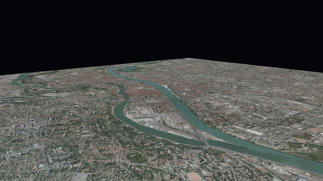
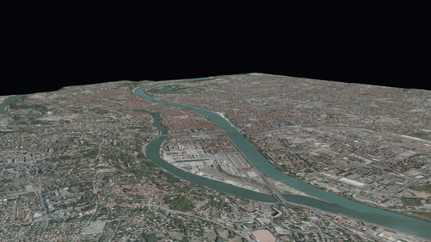

The goal of this tutorial is to give an example on how to use iTowns to visualize data that are in 
[RGF93 / Lambert-93](https://epsg.io/2154) Coordinate Reference System (CRS). These data are ortho-images and Digital 
Elevation Models provided by the [Geoportail](https://www.geoportail.gouv.fr) API.

## Preparing the webpage

The webpage we want to display data on should be structured as follows :
```html
<!DOCTYPE html>
<html>
    <head>
        <meta charset="UTF-8">
        <title>Display a planar view with iTowns</title>
        <style>
            html { height: 100%; }
            body { margin: 0; overflow: hidden; height: 100%; }
            #viewerDiv { margin: auto; height: 100%; width: 100%; padding: 0; }
            canvas { display: block }
        </style>
    </head>
    <body>
        <div id="viewerDiv"></div>
        <script src="js/itowns.js"></script>
        <script type="text/javascript">
            // Our code goes here
        </script>
    </body>
</html>
```

What we are doing here is fairly simple :
- we create a container `<div id="viewerDiv"></div>` that shall serve as a support for the data we wish to display ;
- we define the layout of this container within our webpage ;
- we import iTowns framework (which in our case is located within a `js/` repository).

We shall then add javascript to use iTowns to display data within a `<script>` markup following iTowns import.

## Create a view

As mentioned in [fundamentals tutorial]{@tutorial Fundamentals}, we need a `{@link View}` to support any geographic data
we wish to display.
What we want here is to display data in a RGF93 / Lambert-93 projection, which is a conic local projection. Therefore, 
we should use a `{@link PlanarView}`, which is a specific type of `{@link View}` adapted to local projections. We can 
create it as such :

```js
const viewerDiv = document.getElementById('viewerDiv');

itowns.proj4.defs(
    'EPSG:2154',
    '+proj=lcc +lat_1=49 +lat_2=44 +lat_0=46.5 +lon_0=3 +x_0=700000 +y_0=6600000 +ellps=GRS80 +towgs84=0,0,0,0,0,0,0 ' +
    '+units=m +no_defs',
);
const viewExtent = new itowns.Extent(
    'EPSG:2154',
    644500.0, 659499.99,
    6857500.0, 6867499.99,
);

const view = new itowns.PlanarView(viewerDiv, viewExtent);
```

Several things are done here :
- First, we retrieve the `DomElement` relative to the container we created to serve as a support for iTowns.
- Then we define the geographic extent of our view by instantiating iTowns `{@link Extent}` class.
To do so, we need to pass five argument to `{@link Extent}` constructor, which are :
  - The Coordinates Reference System (CRS) of the extent, given as its EPSG code.
    Here, we use [RGF93 / Lambert-93](https://epsg.io/2154) CRS.
    Not all CRS are defined by default within iTowns, which is why we need to define our CRS using 
    [proj4](https://proj.org/) prior to instantiating the `{@link Extent}` ;
  - The westernmost, easternmost, southernmost and northernmost coordinates of the extent.
- Finally, we create a `{@link PlanarView}` giving it the required `DomElement` and `{@link Extent}` parameters.
    
At this stage, our webpage should look like this : 


The blue rectangle you can see is the view we just created.
By default, iTowns position the camera on top of the view center.
We can change the initial camera position by passing a `CameraTransformOption` object as an optional parameter of 
`{@link PlanarView}` constructor.

To do so, we first need to create our `CameraTransformOption` object :

```js
const placement = {
    coord: viewExtent.center(),
    tilt: 12,
    heading: 40,
    range: 6200,
}
```

We are specifying here that the camera should target the center of the extent, with an azimuth of 40 degrees and a pitch
of 12 degrees under the horizontal plane.
The camera should also be at a distance of 6200 meters from its target (i.e. from the view extent center).

We can then just pass this object into `{@link PlanarView}` constructor parameters :

```js
const view = new itowns.PlanarView(viewerDiv, viewExtent, {
    placement: placement,
});
```

Our webpage should now look like this :


Now that we have a functional `{@link View}`, we shall use it to display geographic data.

## Add a color layer

The first data we want to display on our planar surface is ortho-images.
To do so, we must define the source at which ortho-images data can be fetched thanks to the `{@link Source}` class. 
We can start displaying ortho-images provided by the Grand-Lyon metropolis as such :

```js
const sourceOrtho = new itowns.WMSSource({
    url: 'https://download.data.grandlyon.com/wms/grandlyon',
    name: 'Ortho2009_vue_ensemble_16cm_CC46',
    format: 'image/jpeg',
    crs: 'EPSG:3946',
    extent: viewExtent,
});
const layerOrtho = new itowns.ColorLayer('Ortho', { source: sourceOrtho });
view.addLayer(layerOrtho);
```

In this code, we first define the source specifications of the data we wish to fetch. 
`{@link WMSSource}` needs several mandatory parameters :
- the server `url`, the `name` of the data and their `format`, which are used to generate the final `url` at which data 
  shall be fetched ;
- the CRS of the fetched data ;
- the geographic extent of the resources (set here as the extent of the view).

Then we create a `{@link ColorLayer}` from two parameters : a unique `id` for the layer (`Ortho`) as well as the 
`{@link Source}` instance for the layer data.

Finally, we add the created layer to the view with `view.addLayer(layerOrtho);`.

The result we get at this stage is the following, where we can see the newly added ortho-imagery layer :



## Add an elevation layer

The process of adding an `{@link ElevationLayer}` is similar to what we just did with the `{@link ColorLayer}`. 
At first, we need to define the source of the elevation raster data.
Then we can simply create the `{@link ElevationLayer}`, giving it a unique `id` and the source configuration, and 
finally adding it to the view.

```js
const sourceDEM = new itowns.WMSSource({
    url: 'https://download.data.grandlyon.com/wms/grandlyon',
    name: 'MNT2018_Altitude_2m',
    format: 'image/jpeg',
    crs: 'EPSG:3946',
    extent: viewExtent,
});
const layerDEM = new itowns.ElevationLayer('DEM', {
    source: sourceDEM,
    useColorTextureElevation: true,
    colorTextureElevationMinZ: 144,
    colorTextureElevationMaxZ: 622,
});
view.addLayer(layerDEM);
```

The information within raster DEM data we use here is stored within a color channel. 
Therefore, we must notify it with `useColorTextureElevation` parameter set to `true`, and we must also specify the 
minimal and maximal values found in the color channel.

The result is shown bellow. 



## Result

With this tutorial, we learnt how to use iTowns `{@link ColorLayer}` and an `{@link ElevationLayer}` to display data in 
a local conic projection. 
The code that is shown bellow sums up all the steps it took to do so.

```html
<!DOCTYPE html>
<html>
    <head>
        <meta charset="UTF-8">
        <title>Display a planar view with iTowns</title>
        <style>
            html { height: 100%; }
            body { margin: 0; overflow: hidden; height: 100%; }
            #viewerDiv { margin: auto; height: 100%; width: 100%; padding: 0; }
            canvas { display: block }
        </style>
    </head>
    <body>
        <div id="viewerDiv"></div>
        <script src="js/itowns.js"></script>
        <script type="text/javascript">

            // Retrieve the view container
            const viewerDiv = document.getElementById('viewerDiv');

            // Define the view geographic extent
            itowns.proj4.defs(
                'EPSG:3946',
                '+proj=lcc +lat_1=45.25 +lat_2=46.75 +lat_0=46 +lon_0=3 +x_0=1700000 +y_0=5200000 +ellps=GRS80 ' +
                '+towgs84=0,0,0,0,0,0,0 +units=m +no_defs',
            );
            const viewExtent = new itowns.Extent(
                'EPSG:3946',
                1837816.94334, 1847692.32501,
                5170036.4587, 5178412.82698,
            );

            // Define the camera initial placement
            const placement = {
                coord: viewExtent.center(),
                tilt: 12,
                heading: 40,
                range: 6200,
            };

            // Create the planar view
            const view = new itowns.PlanarView(viewerDiv, viewExtent, {
                placement: placement,
            });

            // Define the source of the ortho-images
            const sourceOrtho = new itowns.WMSSource({
                url: 'https://download.data.grandlyon.com/wms/grandlyon',
                name: 'Ortho2009_vue_ensemble_16cm_CC46',
                format: 'image/jpeg',
                crs: 'EPSG:3946',
                extent: viewExtent,
            });
            // Create the ortho-images ColorLayer and add it to the view
            const layerOrtho = new itowns.ColorLayer('Ortho', { source: sourceOrtho });
            view.addLayer(layerOrtho);

            // Define the source of the dem data
            const sourceDEM = new itowns.WMSSource({
                url: 'https://download.data.grandlyon.com/wms/grandlyon',
                name: 'MNT2018_Altitude_2m',
                format: 'image/jpeg',
                crs: 'EPSG:3946',
                extent: viewExtent,
            });
            // Create the dem ElevationLayer and add it to the view
            const layerDEM = new itowns.ElevationLayer('DEM', {
                source: sourceDEM,
                useColorTextureElevation: true,
                colorTextureElevationMinZ: 144,
                colorTextureElevationMaxZ: 622,
            });
            view.addLayer(layerDEM);
            
        </script>
    </body>
</html>
```
