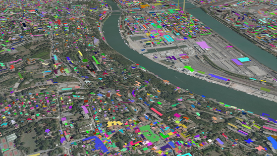
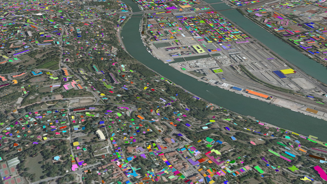
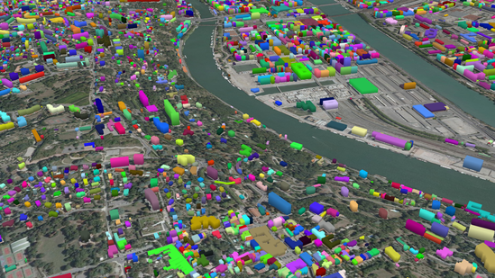
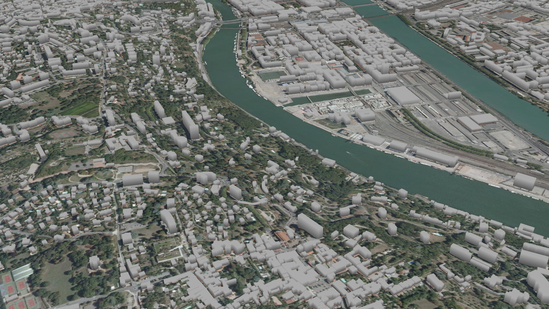
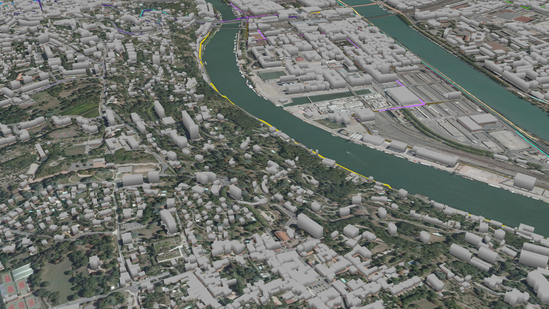

The goal of this tutorial is to give a brief example on how to use iTowns to visualize some vector data as 3D objects.
These vector data shall represent buildings and be displayed on the `PlanarView` we created in the 
[CC46 tutorial]{@tutorial Raster-data-CC46}.

## Preparing the field

To display our buildings, we are going to use the data created in the [CC46 tutorial]{@tutorial Raster-data-CC46}. 
As we are trying to display some buildings, let's move closer to the ground to see something and let's change the camera 
initial rotation. 
For this, we need to change the starting position to something more appropriate.

```html
<!DOCTYPE html>
<html>
    <head>
        <meta charset="UTF-8">
        <title>Vector data in 3D</title>
        <style>
            html { height: 100%; }
            body { margin: 0; overflow: hidden; height: 100%; }
            #viewerDiv { margin: auto; height: 100%; width: 100%; padding: 0; }
            canvas { display: block }
        </style>
     </head>
     <body>
        <div id="viewerDiv"></div>
        <script src="js/itowns.js"></script>
        <script type="text/javascript">

            // Retrieve the view container
            const viewerDiv = document.getElementById('viewerDiv');

            // Define the view geographic extent
            itowns.proj4.defs(
                'EPSG:3946',
                '+proj=lcc +lat_1=45.25 +lat_2=46.75 +lat_0=46 +lon_0=3 +x_0=1700000 +y_0=5200000 +ellps=GRS80 ' +
                '+towgs84=0,0,0,0,0,0,0 +units=m +no_defs',
            );
            const viewExtent = new itowns.Extent(
                'EPSG:3946',
                1837816.94334, 1847692.32501,
                5170036.4587, 5178412.82698,
            );

            // Define the camera initial placement
            const placement = {
                coord: new itowns.Coordinates('EPSG:3946', 1840839, 5172718, 0),
                tilt: 30,
                heading: 45,
                range: 1800,
            };

            // Create the planar view
            const view = new itowns.PlanarView(viewerDiv, viewExtent, {
                placement: placement,
            });

            // Define the source of the ortho-images
            const sourceOrtho = new itowns.WMSSource({
                url: 'https://download.data.grandlyon.com/wms/grandlyon',
                name: 'Ortho2009_vue_ensemble_16cm_CC46',
                format: 'image/jpeg',
                crs: 'EPSG:3946',
                extent: viewExtent,
            });
            // Create the ortho-images ColorLayer and add it to the view
            const layerOrtho = new itowns.ColorLayer('Ortho', { source: sourceOrtho });
            view.addLayer(layerOrtho);

            // Define the source of the dem data
            const sourceDEM = new itowns.WMSSource({
                url: 'https://download.data.grandlyon.com/wms/grandlyon',
                name: 'MNT2018_Altitude_2m',
                format: 'image/jpeg',
                crs: 'EPSG:3946',
                extent: viewExtent,
            });
            // Create the dem ElevationLayer and add it to the view
            const layerDEM = new itowns.ElevationLayer('DEM', {
                source: sourceDEM,
                useColorTextureElevation: true,
                colorTextureElevationMinZ: 144,
                colorTextureElevationMaxZ: 622,
            });
            view.addLayer(layerDEM);
            
        </script>
     </body>
</html>
```

## Adding a GeometryLayer

We want to create and add a layer containing geometries. The best candidate here
is `{@link FeatureGeometryLayer}`, which is a pre-made type of `{@link GeometryLayer}` 
adapted to our use case. Reading the documentation, adding this type
of layer is similar to the other layers. So before declaring the layer, let's
instantiate the source.

```js
const buildingsSource = new itowns.WFSSource({
    url: 'http://wxs.ign.fr/3ht7xcw6f7nciopo16etuqp2/geoportail/wfs?',
    typeName: 'BDTOPO_BDD_WLD_WGS84G:bati_indifferencie',
    crs: 'EPSG:4326',
});
```

With our source instantiated, we can create our `FeatureGeometryLayer`, giving it the usual `id` and `source` parameters :

```js
const buildingsLayer = new itowns.FeatureGeometryLayer('Buildings', {
    source: buildingsSource,
    zoom: { min: 4 },
});

view.addLayer(buildingsLayer);
```

We also added a minimal `zoom` parameter to prevent our data from being displayed under a certain 
zoom level at which we would be too far from the data to distinguish them.

Trying this code will result visually in the following.



We can see the polygons fetched from the data source, each representing a building.
However, these polygons are not on the ground.
Indeed, they were placed after the 3D positions stored in the data, which in our case represent points on the roof of buildings.
So let's start modifying these polygons' altitude to place them on the ground !

## Placing the data on the ground

To achieve the positioning relative to the elevation layer, we will need to add
a parameter to the `FeatureGeometryLayer`, which is its `{@link Style}`.
As mentioned in the [fundamentals]{@tutorial Fundamentals} tutorial, we can modify the appearance and positioning of polygons thanks to the `fill` property of `Style`.
The altitude at which polygons are displayed can be modified using the `base_altitude` parameter, which we set as follows :

```js
function setBuildingsAltitude(properties) {
    console.log(properties);
}

const buildingsSource = new itowns.WFSSource({
    url: 'http://wxs.ign.fr/3ht7xcw6f7nciopo16etuqp2/geoportail/wfs?',
    typeName: 'BDTOPO_BDD_WLD_WGS84G:bati_indifferencie',
    crs: 'EPSG:4326',
});

const buildingsLayer = new itowns.FeatureGeometryLayer('Buildings', {
    source: buildingsSource,
    zoom: { min: 4 },
    style: new itowns.Style({
        fill: {
            base_altitude: setBuildingsAltitude,
        }
    }),
});

view.addLayer(buildingsLayer);
```

If we take a look using `console.log(properties);` at what we have in the
`properties` object, we will get a lot of output. Our data being constituted of
multiple buildings, we get an output for each building. Looking closer to an
output, here is what we can obtain :

```js
geometry_name: "the_geom"
hauteur: 9
id: "bati_indifferencie.19138409"
origin_bat: "Cadastre"
prec_alti: 5
prec_plani: 2.5
z_max: 83.7
z_min: 83.7
```

Reading the documentation of the database we are querying ([section 9.1, page
84](http://professionnels.ign.fr/doc/DC_BDTOPO_3-0.pdf), in French), we have an
explanation on each property. To help us place the data correctly, let's use the
`z_min` and the `hauteur` properties. 
The first one corresponds to the altitude of the building roof, and the second one specifies its height.
We can therefore set the base altitude of our buildings by removing the value of `hauteur` to the value of `z_min` :

```js
function setBuildingsAltitude(properties) {
    return properties.z_min - properties.hauteur;
}
```
Now we can't see completely our buildings. What can we do about that
? Let's give them volume !



## Extruding the data

Like the altitude, the volume of buildings can be changed using the `extrusion_height`
parameter of the `Style.fill` property.

```js
function setBuildingsExtrusion(properties) {
    return properties.hauteur;
}

const buildingsSource = new itowns.WFSSource({
    url: 'http://wxs.ign.fr/3ht7xcw6f7nciopo16etuqp2/geoportail/wfs?',
    typeName: 'BDTOPO_BDD_WLD_WGS84G:bati_indifferencie',
    crs: 'EPSG:4326',
});

const buildingsLayer = new itowns.FeatureGeometryLayer('Buildings', {
    source: buildingsSource,
    zoom: { min: 4 },
    style: new itowns.Style({
        fill: {
            base_altitude: setBuildingsAltitude,
            extrusion_height: setBuildingsExtrusion,
        }
    }),
});

view.addLayer(buildingsLayer);
```

The parameter `properties` of the `setBuildingsExtrusion` method is the same as in
`setBuildingsAltitude`. We noticed there is a `hauteur` (`height` in French) property that
we could use to set the height of the building. Moving around with this gives a
nice view of our buildings :



## Coloring the data

We are not yet touching the color of the buildings. This results in every
building being randomly colored at each time. To solve this, as we did before,
we can add a `color` parameter to the `Style.fill` property.

```js
function setBuildingsColor(properties) {
    return new itowns.THREE.Color(0xaaaaaa);
}

const buildingsSource = new itowns.WFSSource({
    url: 'http://wxs.ign.fr/3ht7xcw6f7nciopo16etuqp2/geoportail/wfs?',
    typeName: 'BDTOPO_BDD_WLD_WGS84G:bati_indifferencie',
    crs: 'EPSG:4326',
});

const buildingsLayer = new itowns.FeatureGeometryLayer('Buildings', {
    source: buildingsSource,
    zoom: { min: 4 },
    style: new itowns.Style({
        fill: {
            color: setBuildingsColor,
            base_altitude: setBuildingsAltitude,
            extrusion_height: setBuildingsExtrusion,
        },
    }),
});
view.addLayer(buildingsLayer);
```

For each building, a new color is created (using `THREE.Color`), and this results
in all buildings being colored in a light gray.



## Position data with no altitude

The buildings data we just displayed had some properties that allowed us to compute buildings base altitude.
However, if none of these properties are available, we can use iTowns `{@link DEMUtils}` to compute objects base altitude.

For example, let's display some bus lines data :

```js
const busSource = new itowns.WFSSource({
    url: 'https://download.data.grandlyon.com/wfs/rdata?',
    typeName: 'tcl_sytral.tcllignebus',
    format: 'geojson',
    crs: 'EPSG:3946',
    version: '2.0.0',
});

const busLayer = new itowns.FeatureGeometryLayer('Bus', {
    source: busSource,
    zoom: { min: 4 },
    style: new itowns.Style({
        stroke: {
            width: 5,
        },
    }),
})
view.addLayer(busLayer);
```

What we do here is similar to what we did with buildings : we define the source of our data (`{@link WFSSource}` here),
we create a `{@link FeatureGeometryLayer}` to support our data and we add it to our `{@link PlanarView}`.

We can then display data properties the same way we did for the buildings.

```js
function setBusAltitude(properties) {
    console.log(properties);
}

const busLayer = new itowns.FeatureGeometryLayer('Bus', {
    source: busSource,
    zoom: { min: 4 },
    style: new itowns.Style({
        stroke: {
            width: 5,
            base_altitude: setBusAltitude,
        },
    }),
})
view.addLayer(busLayer);
```

We can see that no altitude information can be found in properties.
To set the altitude of our bus data, we are going to use a second optional parameter of the `setBusAltitude` method.
This parameter gives `{@link Coordinates}` of points along the line.
With `{@link DEMUtils}`, we can compute the altitude at each of these coordinates :

```js
function setBusAltitude(properties, coordinates) {
    if (coordinates) {
        return (itowns.DEMUtils.getElevationValueAt(view.tileLayer, contour) || 0) + 5
    }
    return 5;
}
```

We raise bus lines altitude a bit (hence the `+ 5`) so that lines appear above the ground, and not half burried.
Here is what we obtain :



## Result

Congratulations ! By reaching here, we know how to display a simple `FeatureGeometryLayer` 
on a `PlanarView`, and change the appearance and positioning of this layer. Here is the final code:

```html
<!DOCTYPE html>
<html>
    <head>
        <meta charset="UTF-8">
        <title>Vector data in 3D</title>
        <style>
            html { height: 100%; }
            body { margin: 0; overflow: hidden; height: 100%; }
            #viewerDiv { margin: auto; height: 100%; width: 100%; padding: 0; }
            canvas { display: block }
        </style>
     </head>
     <body>
        <div id="viewerDiv"></div>
        <script src="js/itowns.js"></script>
        <script type="text/javascript">

            // Retrieve the view container
            const viewerDiv = document.getElementById('viewerDiv');

            // Define the view geographic extent
            itowns.proj4.defs(
                'EPSG:3946',
                '+proj=lcc +lat_1=45.25 +lat_2=46.75 +lat_0=46 +lon_0=3 +x_0=1700000 +y_0=5200000 +ellps=GRS80 ' +
                '+towgs84=0,0,0,0,0,0,0 +units=m +no_defs',
            );
            const viewExtent = new itowns.Extent(
                'EPSG:3946',
                1837816.94334, 1847692.32501,
                5170036.4587, 5178412.82698,
            );

            // Define the camera initial placement
            const placement = {
                coord: new itowns.Coordinates('EPSG:3946', 1840839, 5172718, 0),
                tilt: 30,
                heading: 45,
                range: 1800,
            };

            // Create the planar view
            const view = new itowns.PlanarView(viewerDiv, viewExtent, {
                placement: placement,
            });

            // Define the source of the ortho-images
            const sourceOrtho = new itowns.WMSSource({
                url: 'https://download.data.grandlyon.com/wms/grandlyon',
                name: 'Ortho2009_vue_ensemble_16cm_CC46',
                format: 'image/jpeg',
                crs: 'EPSG:3946',
                extent: viewExtent,
            });
            // Create the ortho-images ColorLayer and add it to the view
            const layerOrtho = new itowns.ColorLayer('Ortho', { source: sourceOrtho });
            view.addLayer(layerOrtho);

            // Define the source of the dem data
            const sourceDEM = new itowns.WMSSource({
                url: 'https://download.data.grandlyon.com/wms/grandlyon',
                name: 'MNT2018_Altitude_2m',
                format: 'image/jpeg',
                crs: 'EPSG:3946',
                extent: viewExtent,
            });
            // Create the dem ElevationLayer and add it to the view
            const layerDEM = new itowns.ElevationLayer('DEM', {
                source: sourceDEM,
                useColorTextureElevation: true,
                colorTextureElevationMinZ: 144,
                colorTextureElevationMaxZ: 622,
            });
            view.addLayer(layerDEM);

            // Define the altitude of buildings
            function setBuildingsAltitude(properties) {
                return properties.z_min - properties.hauteur;
            }

            // Define the height of buildings
            function setBuildingsExtrusion(properties) {
                return properties.hauteur;
            }

            // Define the color of buildings
            function setBuildingsColor(properties) {
                return new itowns.THREE.Color(0xaaaaaa);
            }

            // Define the source of buildings data
            const buildingsSource = new itowns.WFSSource({
                url: 'http://wxs.ign.fr/3ht7xcw6f7nciopo16etuqp2/geoportail/wfs?',
                typeName: 'BDTOPO_BDD_WLD_WGS84G:bati_indifferencie',
                crs: 'EPSG:4326',
            });

            // Create a FeatureGeometryLayer to display buildings data and add it to the view
            const buildingsLayer = new itowns.FeatureGeometryLayer('Buildings', {
                source: buildingsSource,
                zoom: { min: 4 },
                style: new itowns.Style({
                    fill: {
                        color: setBuildingsColor,
                        base_altitude: setBuildingsAltitude,
                        extrusion_height: setBuildingsExtrusion,
                    },
                }),
            });
            view.addLayer(buildingsLayer);

            // Define the altitude of bus lines
            function setBusAltitude(properties, contour) {
                if (contour) {
                    return (itowns.DEMUtils.getElevationValueAt(view.tileLayer, contour) || 0);
                } else {
                    return 0;
                }
            }

            // Define the source of bus lines data
            const busSource = new itowns.WFSSource({
                url: 'https://download.data.grandlyon.com/wfs/rdata?',
                typeName: 'tcl_sytral.tcllignebus',
                format: 'geojson',
                crs: 'EPSG:3946',
                version: '2.0.0',
            });

            // Create a FeatureGeometryLayer to support bus lines data and add it to the view
            const busLayer = new itowns.FeatureGeometryLayer('Bus', {
                source: busSource,
                zoom: { min: 4 },
                style: new itowns.Style({
                    stroke: {
                        width: 5,
                        base_altitude: setBusAltitude,
                    },
                }),
            })
            view.addLayer(busLayer);
            
        </script>
     </body>
</html>
```
