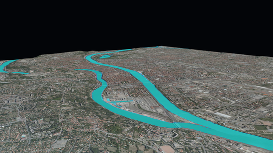
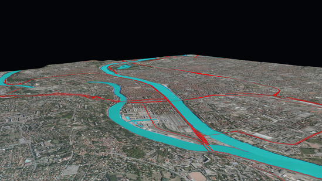
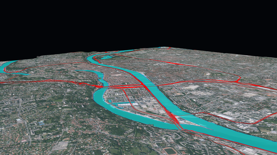

The goal of this tutorial is to give an example on how to use iTowns to visualize some vector data projected on the 
ground.
These data are contained within two GeoJSON files that you can find 
[here](https://raw.githubusercontent.com/iTowns/iTowns2-sample-data/master/lyon-hydro.geojson) and 
[here](https://raw.githubusercontent.com/iTowns/iTowns2-sample-data/master/lyon-roads.geojson).
The first file data consist in polygons which represent river areas around Lyon city.
The second file data consist in lines, representing important transportation axes in the same area.
We shall also display some vector data accessed through a WFS server.
These third data consist in points targeting city offices, along with several properties including city names.
These data shall be displayed on a `PlanarView`, as the one created in the [CC46 tutorial]{@tutorial Raster-data-CC46}.

## Preparing the field

We are going to use the data displayed in the [CC46 tutorial]{@tutorial Raster-data-CC46}.

```html
<!DOCTYPE html>
<html>
    <head>
        <meta charset="UTF-8">
        <title>Vector data on ground</title>
        <style>
            html { height: 100%; }
            body { margin: 0; overflow: hidden; height: 100%; }
            #viewerDiv { margin: auto; height: 100%; width: 100%; padding: 0; }
            canvas { display: block }
        </style>
    </head>
    <body>
        <div id="viewerDiv"></div>
        <script src="js/itowns.js"></script>
        <script type="text/javascript">

            // Retrieve the view container
            const viewerDiv = document.getElementById('viewerDiv');

            // Define the view geographic extent
            itowns.proj4.defs(
                'EPSG:3946',
                '+proj=lcc +lat_1=45.25 +lat_2=46.75 +lat_0=46 +lon_0=3 +x_0=1700000 +y_0=5200000 +ellps=GRS80 ' +
                '+towgs84=0,0,0,0,0,0,0 +units=m +no_defs',
            );
            const viewExtent = new itowns.Extent(
                'EPSG:3946',
                1837816.94334, 1847692.32501,
                5170036.4587, 5178412.82698,
            );

            // Define the camera initial placement
            const placement = {
                coord: viewExtent.center(),
                tilt: 12,
                heading: 40,
                range: 6200,
            };

            // Create the planar view
            const view = new itowns.PlanarView(viewerDiv, viewExtent, {
                placement: placement,
            });

            // Define the source of the ortho-images
            const sourceOrtho = new itowns.WMSSource({
                url: 'https://download.data.grandlyon.com/wms/grandlyon',
                name: 'Ortho2009_vue_ensemble_16cm_CC46',
                format: 'image/jpeg',
                crs: 'EPSG:3946',
                extent: viewExtent,
            });
            // Create the ortho-images ColorLayer and add it to the view
            const layerOrtho = new itowns.ColorLayer('Ortho', { source: sourceOrtho });
            view.addLayer(layerOrtho);

            // Define the source of the dem data
            const sourceDEM = new itowns.WMSSource({
                url: 'https://download.data.grandlyon.com/wms/grandlyon',
                name: 'MNT2018_Altitude_2m',
                format: 'image/jpeg',
                crs: 'EPSG:3946',
                extent: viewExtent,
            });
            // Create the dem ElevationLayer and add it to the view
            const layerDEM = new itowns.ElevationLayer('DEM', {
                source: sourceDEM,
                useColorTextureElevation: true,
                colorTextureElevationMinZ: 144,
                colorTextureElevationMaxZ: 622,
            });
            view.addLayer(layerDEM);

        </script>
    </body>
</html>
```

## Display river areas on the ground

The first mandatory thing we need to do for our river areas vector data to be displayed is to define their source.
Our data is contained within a GeoJSON file, so we can use iTowns `{@link FileSource}` :

```js
const hydroSource = new itowns.FileSource({
    url: 'https://raw.githubusercontent.com/iTowns/iTowns2-sample-data/master/lyon-hydro.geojson',
    crs: 'EPSG:4326',
    format: 'application/json',
});
```

We give three arguments to our `{@link FileSource}`, which are pretty self-explanatory. 
The `url` and `crs` define the URL at which our file can be found, and the Coordinates Reference System (CRS) of the 
data contained within the file.
The `format` parameter defines the format of our file. 
ITowns needs this format to determine which method it shall use to download data and transform them into iTowns 
understandable objects.

Now that the source of our vector data is set, we need to create a `{@link Layer}` which will contain the data.
We want our vector data to be displayed as flattened on the ground entities.
To obtain this result, the data must be contained in a `{@link ColorLayer}`.
We can therefore create our data `{@link ColorLayer}` and add it to our `{@link PlanarView}` as such : 

```js
const hydroLayer = new itowns.ColorLayer('hydro', {
    source: hydroSource,
});
view.addLayer(hydroLayer);
```

Doing this will result visually in nothing.
That is because we did not yet define a style for our vector data. 
To be more precise, our data consist in polygons, and we did not tell iTowns which appearance it should use to display 
these polygons, so iTowns did not display them.
We can correct this by creating a `{@link Style}` and applying it to our `{@link ColorLayer}` :

```js
const hydroStyle = new itowns.Style({
    fill: {
        color: 'cyan',
        opacity: 0.5,
    },
    stroke: {
        color: 'blue',
    },
});

const hydroLayer = new itowns.ColorLayer('hydro', {
    source: hydroSource,
    style: hydroStyle,
});
```

In this code sample, we simply told iTowns to color all polygons' interior (accessed with the `fill` parameter) in cyan 
with a 50% transparency.
We also told iTowns to color the edges of the polygons (accessed with the `stroke` parameter) in blue.
The result is the following :



## Display important transportation axes

The process of displaying data about transportation axes is almost exactly the same as for the river areas.
We must first define the source of our data (a GeoJSON file in our case) :

```js
const roadSource = new itowns.FileSource({
    url: 'https://raw.githubusercontent.com/iTowns/iTowns2-sample-data/master/lyon-roads.geojson',
    crs: 'EPSG:4326',
    format: 'application/json',
});
```

Then we can define the `Style` with which our data shall be displayed :

```js
const roadStyle = new itowns.Style({
    stroke: {
        color: 'red',
        width: 3,
    },
});
```

Here, we decided that our lines should be represented in red, with a width of 3 pixels.
Finally, we can create a `ColorLayer` to support our data, and add it to the view :

```js
const roadLayer = new itowns.ColorLayer('roads', {
    source: roadSource,
    style: roadStyle,
});
view.addLayer(roadLayer);
```

The result is the following :



## Display city names

The last data we want to display on our `{@link PlanarView}` are city names.
We want to display them as labels.
These data are stored on a `WFS` server, so we can define their source with `{@link WFSSource}` :

```js
const citySource = new itowns.WFSSource({
    url: 'https://wxs.ign.fr/cartovecto/geoportail/wfs?',
    typeName: 'BDCARTO_BDD_WLD_WGS84G:zone_habitat_mairie',
    crs: 'EPSG:3946',
})
```

We can then define the style of city names data, using `text` parameter of `{@link Style}`.

```js
const cityStyle = new itowns.Style({
    text: {
        field: '{toponyme}',
        color: 'white',
        transform: 'uppercase',
        size: 15,
        haloColor: 'rgba(20, 20, 20, 0.8)',
        haloWidth: 3,
    },
});
```

Finaly, we can display our data within a `{@link Layer}`.
The best `{@link Layer}` candidate to display labels is obviously `{@link LabelLayer}`, which we can instantiate as 
such :

```js
const cityLayer = new itowns.LabelLayer('cities', {
    source: citySource,
    style: cityStyle,
});
view.addLayer(cityLayer);
```

Our webpage should now look like this :



## Result

By reaching here, you are now able to display simple vector data projected on the ground. The final code to do so is the 
following :

```html
<!DOCTYPE html>
<html>
    <head>
        <meta charset="UTF-8">
        <title>Vector data on ground</title>
        <style>
            html { height: 100%; }
            body { margin: 0; overflow: hidden; height: 100%; }
            #viewerDiv { margin: auto; height: 100%; width: 100%; padding: 0; }
            canvas { display: block }
        </style>
    </head>
    <body>
        <div id="viewerDiv"></div>
        <script src="js/itowns.js"></script>
        <script type="text/javascript">

            // Retrieve the view container
            const viewerDiv = document.getElementById('viewerDiv');

            // Define the view geographic extent
            itowns.proj4.defs(
                'EPSG:3946',
                '+proj=lcc +lat_1=45.25 +lat_2=46.75 +lat_0=46 +lon_0=3 +x_0=1700000 +y_0=5200000 +ellps=GRS80 ' +
                '+towgs84=0,0,0,0,0,0,0 +units=m +no_defs',
            );
            const viewExtent = new itowns.Extent(
                'EPSG:3946',
                1837816.94334, 1847692.32501,
                5170036.4587, 5178412.82698,
            );

            // Define the camera initial placement
            const placement = {
                coord: viewExtent.center(),
                tilt: 12,
                heading: 40,
                range: 6200,
            };

            // Create the planar view
            const view = new itowns.PlanarView(viewerDiv, viewExtent, {
                placement: placement,
            });

            // Define the source of the ortho-images
            const sourceOrtho = new itowns.WMSSource({
                url: 'https://download.data.grandlyon.com/wms/grandlyon',
                name: 'Ortho2009_vue_ensemble_16cm_CC46',
                format: 'image/jpeg',
                crs: 'EPSG:3946',
                extent: viewExtent,
            });
            // Create the ortho-images ColorLayer and add it to the view
            const layerOrtho = new itowns.ColorLayer('Ortho', { source: sourceOrtho });
            view.addLayer(layerOrtho);

            // Define the source of the dem data
            const sourceDEM = new itowns.WMSSource({
                url: 'https://download.data.grandlyon.com/wms/grandlyon',
                name: 'MNT2018_Altitude_2m',
                format: 'image/jpeg',
                crs: 'EPSG:3946',
                extent: viewExtent,
            });
            // Create the dem ElevationLayer and add it to the view
            const layerDEM = new itowns.ElevationLayer('DEM', {
                source: sourceDEM,
                useColorTextureElevation: true,
                colorTextureElevationMinZ: 144,
                colorTextureElevationMaxZ: 622,
            });
            view.addLayer(layerDEM);

            // Define a Source for the river areas
            const hydroSource = new itowns.FileSource({
                url: 'https://raw.githubusercontent.com/iTowns/iTowns2-sample-data/master/lyon-hydro.geojson',
                crs: 'EPSG:4326',
                format: 'application/json',
            });

            // Define a Style for the river areas
            const hydroStyle = new itowns.Style({
                fill: {
                    color: 'cyan',
                    opacity: 0.5,
                },
                stroke: {
                    color: 'blue',
                },
            });

            // Create a river areas ColorLayer and add it to the view
            const hydroLayer = new itowns.ColorLayer('hydro', {
                source: hydroSource,
                style: hydroStyle,
            });
            view.addLayer(hydroLayer);

            // Define a Source for the transportation axes
            const roadSource = new itowns.FileSource({
                url: 'https://raw.githubusercontent.com/iTowns/iTowns2-sample-data/master/lyon-roads.geojson',
                crs: 'EPSG:4326',
                format: 'application/json',
            });

            // Define a Style for the transportation axes
            const roadStyle = new itowns.Style({
                stroke: {
                    color: 'red',
                    width: 3,
                },
            });

            // Create a transportation axes ColorLayer and add it to the view
            const roadLayer = new itowns.ColorLayer('roads', {
                source: roadSource,
                style: roadStyle,
            });
            view.addLayer(roadLayer);

            // Define a Source for the city names
            const citySource = new itowns.WFSSource({
                url: 'https://wxs.ign.fr/cartovecto/geoportail/wfs?',
                typeName: 'BDCARTO_BDD_WLD_WGS84G:zone_habitat_mairie',
                crs: 'EPSG:3946',
            });

            // Define a Style for the city names
            const cityStyle = new itowns.Style({
                text: {
                    field: '{toponyme}',
                    color: 'white',
                    transform: 'uppercase',
                    size: 15,
                    haloColor: 'rgba(20, 20, 20, 0.8)',
                    haloWidth: 3,
                },
            });

            // Create a LabelLayer to display city names and add it to the view
            const cityLayer = new itowns.LabelLayer('cities', {
                source: citySource,
                style: cityStyle,
            });
            view.addLayer(cityLayer);
            
        </script>
    </body>
</html>
```
